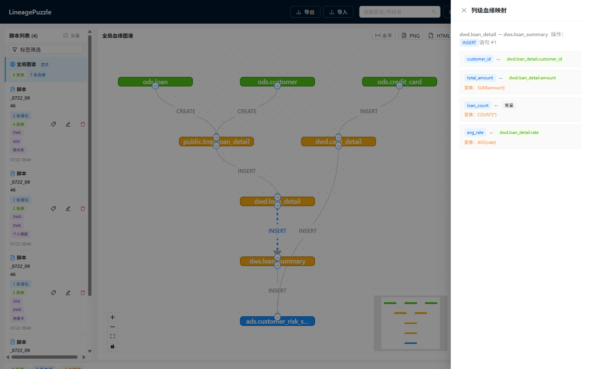
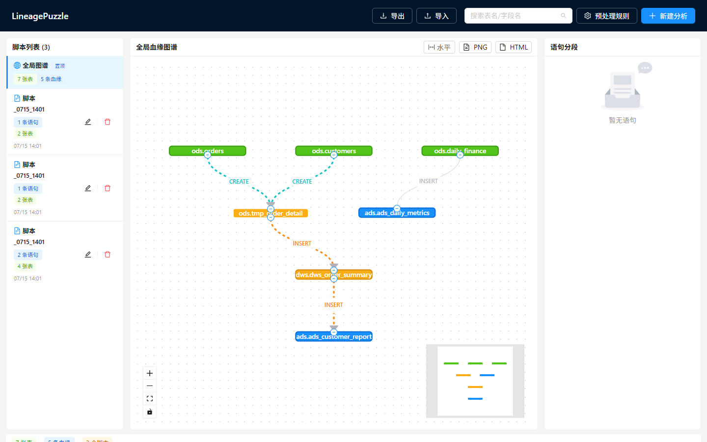
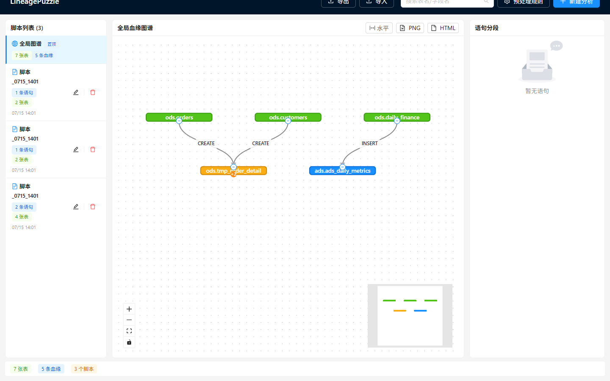
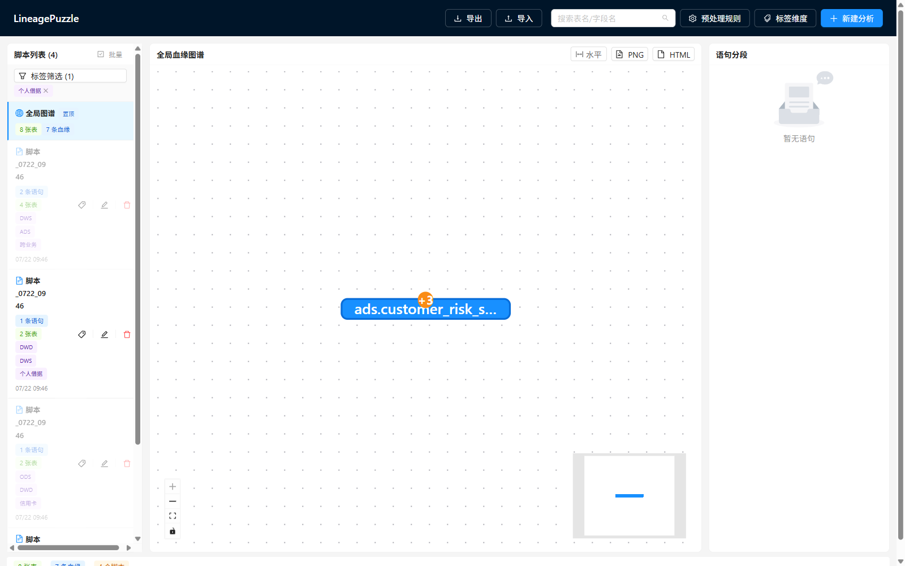
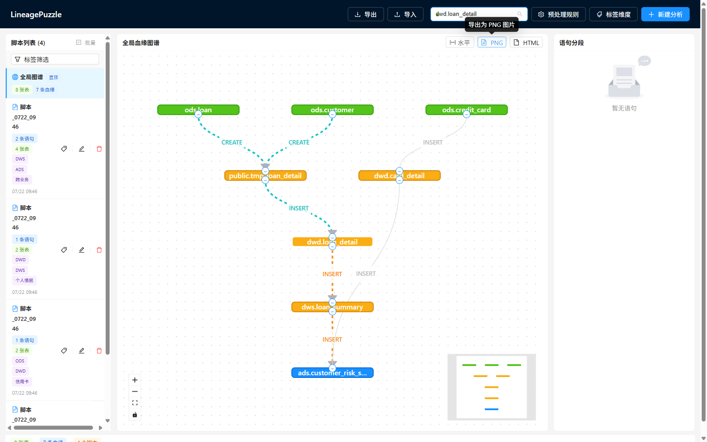
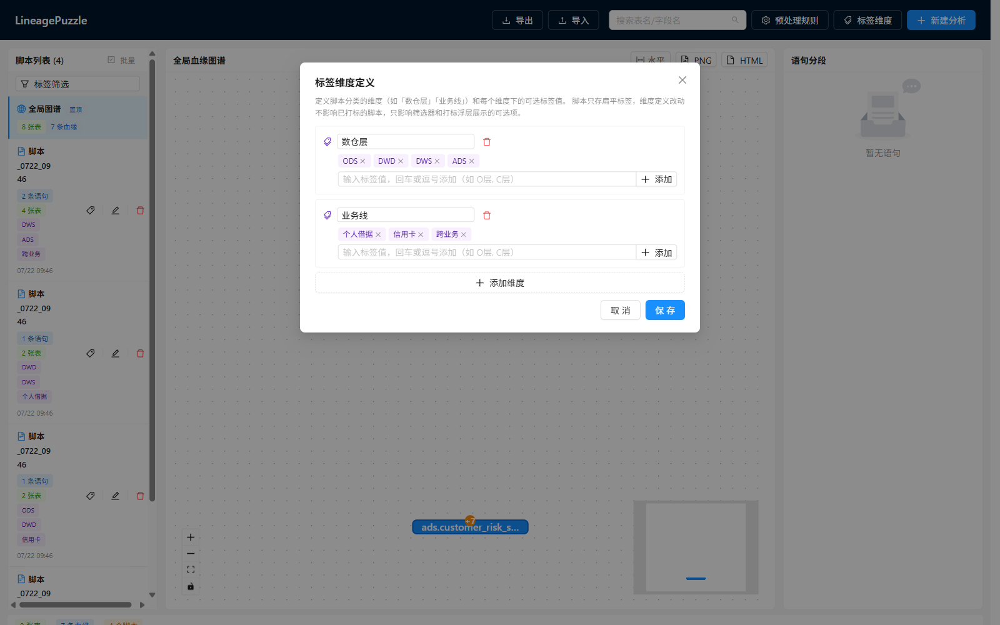
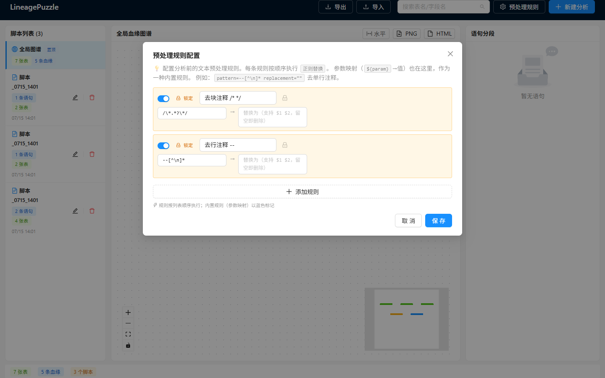

# LineagePuzzle

[![zread](https://img.shields.io/badge/Ask_Zread-_.svg?style=flat&color=00b0aa&labelColor=000000&logo=data%3Aimage%2Fsvg%2Bxml%3Bbase64%2CPHN2ZyB3aWR0aD0iMTYiIGhlaWdodD0iMTYiIHZpZXdCb3g9IjAgMCAxNiAxNiIgZmlsbD0ibm9uZSIgeG1sbnM9Imh0dHA6Ly93d3cudzMub3JnLzIwMDAvc3ZnIj4KPHBhdGggZD0iTTQuOTYxNTYgMS42MDAxSDIuMjQxNTZDMS44ODgxIDEuNjAwMSAxLjYwMTU2IDEuODg2NjQgMS42MDE1NiAyLjI0MDFWNC45NjAxQzEuNjAxNTYgNS4zMTM1NiAxLjg4ODEgNS42MDAxIDIuMjQxNTYgNS42MDAxSDQuOTYxNTZDNS4zMTUwMiA1LjYwMDEgNS42MDE1NiA1LjMxMzU2IDUuNjAxNTYgNC45NjAxVjIuMjQwMUM1LjYwMTU2IDEuODg2NjQgNS4zMTUwMiAxLjYwMDEgNC45NjE1NiAxLjYwMDFaIiBmaWxsPSIjZmZmIi8%2BCjxwYXRoIGQ9Ik00Ljk2MTU2IDEwLjM5OTlIMi4yNDE1NkMxLjg4ODEgMTAuMzk5OSAxLjYwMTU2IDEwLjY4NjQgMS42MDE1NiAxMS4wMzk5VjEzLjc1OTlDMS42MDE1NiAxNC4xMTM0IDEuODg4MSAxNC4zOTk5IDIuMjQxNTYgMTQuMzk5OUg0Ljk2MTU2QzUuMzE1MDIgMTQuMzk5OSA1LjYwMTU2IDE0LjExMzQgNS42MDE1NiAxMy43NTk5VjExLjAzOTlDNS42MDE1NiAxMC42ODY0IDUuMzE1MDIgMTAuMzk5OSA0Ljk2MTU2IDEwLjM5OTlaIiBmaWxsPSIjZmZmIi8%2BCjxwYXRoIGQ9Ik0xMy43NTg0IDEuNjAwMUgxMS4wMzg0QzEwLjY4NSAxLjYwMDEgMTAuMzk4NCAxLjg4NjY0IDEwLjM5ODQgMi4yNDAxVjQuOTYwMUMxMC4zOTg0IDUuMzEzNTYgMTAuNjg1IDUuNjAwMSAxMS4wMzg0IDUuNjAwMUgxMy43NTg0QzE0LjExMTkgNS42MDAxIDE0LjM5ODQgNS4zMTM1NiAxNC4zOTg0IDQuOTYwMVYyLjI0MDFDMTQuMzk4NCAxLjg4NjY0IDE0LjExMTkgMS42MDAxIDEzLjc1ODQgMS42MDAxWiIgZmlsbD0iI2ZmZiIvPgo8cGF0aCBkPSJNNCAxMkwxMiA0TDQgMTJaIiBmaWxsPSIjZmZmIi8%2BCjxwYXRoIGQ9Ik00IDEyTDEyIDQiIHN0cm9rZT0iI2ZmZiIgc3Ryb2tlLXdpZHRoPSIxLjUiIHN0cm9rZS1saW5lY2FwPSJyb3VuZCIvPgo8L3N2Zz4K&logoColor=ffffff)](https://zread.ai/BronyaEVE/LineagePuzzle)
[](https://z.ai)

**简体中文** | [English](./README.en.md)

> 内网环境下零依赖的 SQL 数据血缘可视化工具 —— 粘贴 DML 脚本，自动生成表级 + 列级血缘图谱，像拼图一样逐步还原整个数仓的数据流转。


---

## 🎯 为什么做这个项目

现代化的数据平台（Dataphin、WhaleOps、云厂商 DataWorks 等）和数据库本身都自带血缘分析，但它们大多假设你有一个**完整的、联网的、新建的大数据平台**。现实里很多团队的处境是：

- **调度工具老旧**：还在用 Control-M、Kettle 或自研调度，调度器只管跑脚本，从不记录"这张表的数据到底从哪来"
- **SQL 脚本堆积如山**：数仓里成百上千个 ETL 脚本，改一个表不知道会炸到哪里，接手老项目的人对着 SQL 查三天才能理清一条链路
- **数据库自带血缘不够用**：PostgreSQL 的依赖视图只到表级、不覆盖 ETL 全链路，且无法可视化
- **内网隔离，重型平台装不进来**：Airflow/DataHub/OpenLineage 这类方案要 Kafka、要 K8s、要元数据库，内网环境根本没法落地

**LineagePuzzle 就是为了这个场景而生的**：一个能装在 U 盘里、双击就跑的小工具，纯靠 SQL 语法分析提取血缘，不依赖任何大数据平台、不连数据库也能工作。把那些被先进平台"当作标配"的血缘分析能力，以最轻量的方式带到任何内网环境。

## 👥 适合谁

- **接手老项目的开发者** —— 面对一堆没文档的 ETL 脚本，想快速搞清数据从哪来、到哪去、改一张表影响谁
- **内网 / 隔离环境团队** —— 装不了重型血缘平台，需要零依赖、能离线运行的轻量方案
- **数仓开发 / 数据治理** —— 想要增量地、脚本粒度地梳理血缘，而不是一次性导入整个数据字典

---


## ✨ 核心特性

- **增量构建** —— 每次分析一个脚本，血缘自动累积到全局图谱，无需一次性提交所有脚本
- **离线优先** —— 基于 `sqlglot` AST 静态解析，**无需数据库连接** 即可提取完整血缘
- **表级 + 列级** —— 不仅看表间流转，还能点边查看 `目标列 ← 源列` 及变换表达式（`SUM(amount)`、`price*qty`）
- **影响分析** —— 点击节点，高亮其全部上游链路（青色）和下游链路（橙色），菱形依赖完整覆盖
- **节点折叠** —— 复杂图谱里点节点边缘的 +/- 按钮折叠/展开上游或下游链路，专注看局部
- **标签筛选** —— 给脚本打扁平多维度标签（如 `[C层, 个人借据]`），全局画布按标签筛选只显示命中脚本贡献的血缘，类似 Excel 筛选
- **参数化 SQL** —— 支持 ETL 模板占位符 `${icl_schema}`，配合「预处理规则」替换成实际 schema（参数映射为内置规则特例）
- **批量导入** —— 一次拖入多个 `.sql` 文件或 `.zip` 压缩包，每个文件成为独立脚本
- **零安装部署** —— 便携版自带 Python 运行时，目标机双击即用

### 截图预览

<details>
<summary>📸 点击展开</summary>

| | |
|:---:|:---:|
| **全局血缘图谱** | **列级血缘映射** |
|  |  |
| 全局视图聚合所有脚本，分层血缘流向 | 点边查看 `目标列 ← 源列` 及变换表达式 |
| **影响分析** | **节点折叠** |
|  |  |
| 点节点：青色 = 上游链路，橙色 = 下游链路 | +/- 按钮折叠/展开上下游链路 |
| **标签筛选** | **搜索（表名=影响分析）** |
|  |  |
| 按维度筛选命中脚本的血缘切片 | 搜表名触发上下游双色高亮 |
| **标签维度定义** | **预处理规则** |
|  |  |
| 管理员维护维度名 + 标签值 | 正则替换规则；参数映射为内置类型 |

</details>

---

## 🚀 Quick Start

提供两条路径，按你的环境选：

### 方式 A：下载便携包（内网 / 普通用户，零安装）

> 适合：内网隔离环境、不想折腾 Python/Node 环境的用户。

1. 到 [Releases](../../releases/latest) 页面下载 `LineagePuzzle-v2.0.0-portable.zip`（约 44MB）
2. 解压到任意目录（路径避免中文和空格）
3. 双击 `run.bat` —— uvicorn **后台启动**（不保留终端窗口），浏览器自动打开 `http://localhost:8000`
4. 停止服务双击 `stop.bat`

**就这样。** 目标机不需要安装 Python、Node、Docker，也不需要联网。便携包自带 Python 3.13 运行时和全部依赖。把整个文件夹拷进 U 盘，到哪台内网机器都能跑。

> **启动/停止机制：** `run.bat` 是薄壳，通过自带的 `pythonw.exe`（无窗口版 Python）调用 `launcher.pyw`。启动器管理 uvicorn 子进程生命周期：PID 写入 `logs/lineage.pid`，uvicorn 输出重定向到 `logs/lineage.log`，启动器自身日志在 `logs/launcher.log`。服务运行中再双击 `run.bat` 只会重新打开浏览器（不会重复启动）。`stop.bat` 优先按 PID 文件停止，PID 文件失效时（比如硬关电脑后）按端口 8000 查监听进程兜底。

> 让同事访问？服务默认监听 `0.0.0.0:8000`，同事用 `http://你的IP:8000` 即可访问。拷贝 `app/data/` 给他，他启动后能看到相同的全局图谱。

### 方式 B：从源码构建（开发者）

> 适合：想阅读/修改代码、贡献 PR 的开发者。需要联网环境。

```bash
git clone https://github.com/BronyaEVE/LineagePuzzle.git
cd LineagePuzzle

# 安装依赖
cd backend && pip install -r requirements.txt
cd ../frontend && npm install

# 启动（后端 :8000 + 前端 dev :5173）
cd .. && ./ctl.sh start
```

打开 `http://localhost:5173` ，点右上角「新建分析」，粘贴一段 SQL：

```sql
CREATE TEMP TABLE tmp_detail AS
SELECT o.id, o.amount, c.name FROM orders o JOIN customers c ON o.cid = c.id;

INSERT INTO order_report (order_id, amount, customer_name)
SELECT id, amount * 1.1, name FROM tmp_detail;
```

点「分析血缘」—— 你会看到 `orders`、`customers`（绿）→ `tmp_detail`（黄）→ `order_report`（蓝）的血缘链路。再点任意一条边，右侧弹出列级映射。

**一体化部署**（生产，单端口）：

```bash
cd frontend && npm run build        # 构建前端到 dist/
cd ../backend && uvicorn app.main:app --host 0.0.0.0 --port 8000
```

打开 `http://localhost:8000`（单进程同时服务页面 + API）。

> **不需要数据库**。血缘提取纯靠 SQL 语法解析，数据库仅用于可选的表存在性校验。

---

## 🧩 两种分析模式

| 模式 | 适用 | 说明 |
|------|------|------|
| **离线模式**（默认） | 无数据库环境 | 纯 AST 解析，粘贴 SQL 即可，提示「分析完成（离线模式）」 |
| **在线模式** | 有 PostgreSQL | 展开「高级选项」填连接信息，额外校验表是否存在、补充列信息 |

---

## 📖 功能一览

### 列级血缘（点边查看）

点击图中任意一条边，右侧 Drawer 展示该边的列级映射：

```
public.orders → public.order_report   操作：INSERT   语句 #1

[order_id]      ← [public.orders.id]
[amount]        ← [public.orders.amount]      变换：amount * 1.1
[customer_name] ← [public.customers.name]
```


支持：显式列映射、JOIN+别名、聚合（`SUM`/`COUNT`）、表达式（`price*qty`）、CTAS、UPDATE SET、**派生表穿透**（子查询列追溯到物理表）。`SELECT *` 因无表结构降级为表级（边仍正常生成）。

### 影响分析（点节点高亮链路）

点击节点，高亮其**全部**上下游链路（基于 `all_simple_paths`，菱形依赖 `A→B→C` 且 `A→C` 时三条边全亮）：

- 🔵 下游（改这张表会影响谁）—— 橙色高亮
- 🔼 上游（这张表的数据来自谁）—— 青色高亮

### 批量导入

「新建分析」弹窗切换到「批量导入文件」标签，拖入多个 `.sql` 或一个 `.zip`（含多个 `.sql`），每个文件成为独立脚本。

### 其他

- **搜索框**：模糊匹配表名/字段名。搜表名触发影响分析（与点节点同效果）；搜字段高亮该字段流转经过的所有边。重复搜同一目标也会重新聚焦
- **预处理规则**：配置正则替换规则（name/pattern/replacement/enabled），应对各种奇怪 SQL 格式；参数映射为内置规则特例（id 以 `param-` 前缀），分析时自动应用
- **导入/导出**：一键备份/迁移全部血缘数据（JSON）
- **图导出**：导出当前图谱为 PNG / 独立 HTML

> 完整功能说明、架构设计、API 文档见 **[docs/PROJECT.md](docs/PROJECT.md)**。

---

## 🏗️ 技术栈

| 层 | 技术 |
|----|------|
| 前端 | React 19 + TypeScript + antd v6 + React Flow (@xyflow/react v12) |
| 后端 | Python FastAPI + Pydantic |
| SQL 解析 | sqlglot（AST 静态解析，唯一血缘来源） |
| 图算法 | networkx（影响分析的最短/全路径、环检测） |
| 存储 | JSON / JSONL + filelock（无数据库依赖） |
| 部署 | Python embeddable（便携版零安装） |

---

## 📂 项目结构

```
datalineage_visualizer/
├── backend/
│   ├── app/
│   │   ├── api/           # FastAPI 路由（21 个 REST 端点）
│   │   ├── services/      # 血缘提取、存储、预处理规则（核心逻辑）
│   │   ├── models/        # Pydantic 数据模型
│   │   └── main.py        # FastAPI 应用 + 静态文件托管
│   ├── tests/             # 292 个测试（覆盖率 93%）
│   └── requirements.txt   # 9 个核心依赖
├── frontend/
│   └── src/
│       ├── components/    # 血缘图、搜索框、批量导入等组件
│       ├── api/           # REST 客户端
│       └── types/         # TypeScript 类型定义
├── docs/
│   ├── PROJECT.md         # 详细项目文档（架构/API/深度用法，中文）
│   ├── PROJECT.en.md      # 详细项目文档（英文）
│   └── images/            # 截图
├── ctl.sh                 # 一键启停脚本
└── pack_portable.bat      # 便携版打包脚本
```

---

## 📊 测试

```bash
cd backend && python -m pytest    # 292 passed, 覆盖率 93%
```

测试文件（11 个文件，覆盖全部层）：

| 文件 | 测试数 | 覆盖范围 |
|------|--------|---------|
| `test_preprocessor` | 33 | 去注释、DO block 提取、事务补分号、预处理规则 |
| `test_param_mapping` | 30 | 参数替换、预处理规则 CRUD、自动迁移 |
| `test_splitter` | 28 | 语句拆分、类型检测、事务块 |
| `test_api` | 55 | 全部 21 个 REST 端点（TestClient 端到端）、标签端点、批量带标签 |
| `test_store` | 51 | 持久化、影响分析、导入导出、路径遍历防护、标签维度+打标 |
| `test_lineage_e2e` | 15 | 端到端血缘：CASE WHEN、DO block、跨 schema、事务 |
| `test_lineage_extractor` | 18 | 表级血缘提取、多源 JOIN、临时表链路 |
| `test_column_lineage` | 18 | 列级映射、子查询穿透、UPDATE 血缘 |
| `test_normalize` | 15 | 表名归一化、大小写折叠（PostgreSQL 语义） |
| `test_impact_analysis` | 14 | all_simple_paths、菱形依赖、路径爆炸防护 |
| `test_analyzer` | 4 | 离线模式、DB 降级 |

---

## 📄 License

MIT
