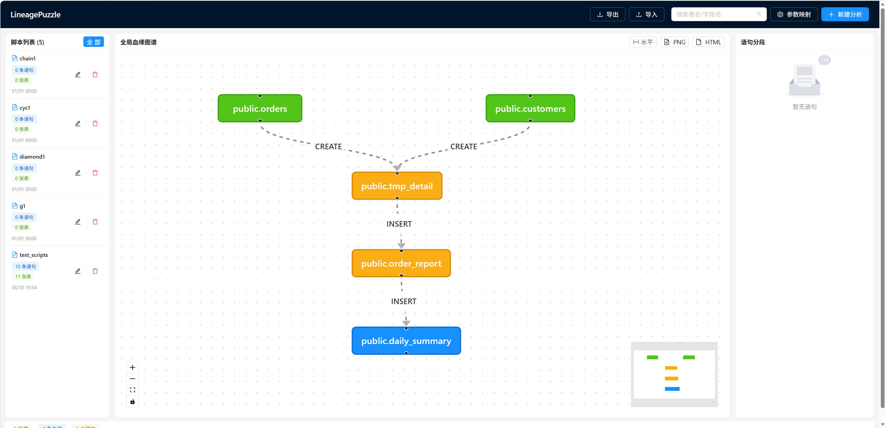

# LineagePuzzle

> 内网环境下零依赖的 SQL 数据血缘可视化工具 —— 粘贴 DML 脚本，自动生成表级 + 列级血缘图谱，像拼图一样逐步还原整个数仓的数据流转。


<!-- 📷 截图需求：完整三栏布局的全局血缘图。
     全屏浏览器后截图，画面要包含：左栏脚本列表 + 中栏血缘图（带流动箭头、
     绿/黄/蓝节点、有 JOIN 分叉展现复杂度）+ 右栏语句面板 + 顶部搜索框。
     用测试脚本 backend/tests/test_scripts.sql 的示例数据，4-6 个表。 -->

---

## 🎯 为什么做这个项目

现代化的数据平台（Dataphin、WhaleOps、云厂商 DataWorks 等）和数据库本身都自带血缘分析，但它们大多假设你有一个**完整的、联网的、新建的大数据平台**。现实里很多团队的处境是：

- **调度工具老旧**：还在用 Control-M、Kettle 或自研调度，调度器只管跑脚本，从不记录"这张表的数据到底从哪来"
- **SQL 脚本堆积如山**：数仓里成百上千个 ETL 脚本，改一个表不知道会炸到哪里，接手老项目的人对着 SQL 查三天才能理清一条链路
- **数据库自带血缘不够用**：PostgreSQL 的依赖视图只到表级、不覆盖 ETL 全链路，且无法可视化
- **内网隔离，重型平台装不进来**：Airflow/DataHub/OpenLineage 这类方案要 Kafka、要 K8s、要元数据库，内网环境根本没法落地

**LineagePuzzle 就是为了这个场景而生的**：一个能装在 U 盘里、双击就跑的小工具，纯靠 SQL 语法分析提取血缘，不依赖任何大数据平台、不连数据库也能工作。把那些被先进平台"当作标配"的血缘分析能力，以最轻量的方式带到任何内网环境。

## 👥 适合谁

- **接手老项目的开发者** —— 面对一堆没文档的 ETL 脚本，想快速搞清数据从哪来、到哪去、改一张表影响谁
- **内网 / 隔离环境团队** —— 装不了重型血缘平台，需要零依赖、能离线运行的轻量方案
- **数仓开发 / 数据治理** —— 想要增量地、脚本粒度地梳理血缘，而不是一次性导入整个数据字典

---


## ✨ 核心特性

- **增量构建** —— 每次分析一个脚本，血缘自动累积到全局图谱，无需一次性提交所有脚本
- **离线优先** —— 基于 `sqlglot` AST 静态解析，**无需数据库连接** 即可提取完整血缘
- **表级 + 列级** —— 不仅看表间流转，还能点边查看 `目标列 ← 源列` 及变换表达式（`SUM(amount)`、`price*qty`）
- **影响分析** —— 点击节点，高亮其全部上游链路（青色）和下游链路（橙色），菱形依赖完整覆盖
- **参数化 SQL** —— 支持 ETL 模板占位符 `${icl_schema}`，配合全局映射表替换成实际 schema
- **批量导入** —— 一次拖入多个 `.sql` 文件或 `.zip` 压缩包，每个文件成为独立脚本
- **零安装部署** —— 便携版自带 Python 运行时，目标机双击即用

---

## 🚀 Quick Start（5 分钟跑起来）

### 方式一：开发模式（推荐首次体验）

```bash
# 1. 安装后端依赖
cd backend && pip install -r requirements.txt

# 2. 安装前端依赖
cd ../frontend && npm install

# 3. 一键启停（后端 :8000 + 前端 :5173）
cd .. && ./ctl.sh start
```

打开 **http://localhost:5173** ，点右上角「新建分析」，粘贴一段 SQL：

```sql
CREATE TEMP TABLE tmp_detail AS
SELECT o.id, o.amount, c.name FROM orders o JOIN customers c ON o.cid = c.id;

INSERT INTO order_report (order_id, amount, customer_name)
SELECT id, amount * 1.1, name FROM tmp_detail;
```

点「分析血缘」—— 你会看到 `orders`、`customers`（绿）→ `tmp_detail`（黄）→ `order_report`（蓝）的血缘链路。再点任意一条边，右侧弹出列级映射。

### 方式二：一体化部署（生产，单端口）

```bash
cd frontend && npm run build        # 构建前端到 dist/
cd ../backend
uvicorn app.main:app --host 0.0.0.0 --port 8000
```

打开 **http://localhost:8000** （单进程同时服务页面 + API）。

> **不需要数据库**。血缘提取纯靠 SQL 语法解析，数据库仅用于可选的表存在性校验。

---

## 🧩 两种分析模式

| 模式 | 适用 | 说明 |
|------|------|------|
| **离线模式**（默认） | 无数据库环境 | 纯 AST 解析，粘贴 SQL 即可，提示「分析完成（离线模式）」 |
| **在线模式** | 有 PostgreSQL | 展开「高级选项」填连接信息，额外校验表是否存在、补充列信息 |

---

## 📖 功能一览

### 列级血缘（点边查看）

点击图中任意一条边，右侧 Drawer 展示该边的列级映射：

```
public.orders → public.order_report   操作：INSERT   语句 #1

[order_id]      ← [public.orders.id]
[amount]        ← [public.orders.amount]      变换：amount * 1.1
[customer_name] ← [public.customers.name]
```


<!-- 📷 截图需求：点一条边后弹出的列级血缘 Drawer。
     画面要包含：中栏血缘图 + 右侧 Drawer，能看清「目标列 ← 源列」和变换表达式。 -->

支持：显式列映射、JOIN+别名、聚合（`SUM`/`COUNT`）、表达式（`price*qty`）、CTAS、UPDATE SET、**派生表穿透**（子查询列追溯到物理表）。`SELECT *` 因无表结构降级为表级（边仍正常生成）。

### 影响分析（点节点高亮链路）

点击节点，高亮其**全部**上下游链路（基于 `all_simple_paths`，菱形依赖 `A→B→C` 且 `A→C` 时三条边全亮）：

- 🔵 下游（改这张表会影响谁）—— 橙色高亮
- 🔼 上游（这张表的数据来自谁）—— 青色高亮

### 批量导入

「新建分析」弹窗切换到「批量导入文件」标签，拖入多个 `.sql` 或一个 `.zip`（含多个 `.sql`），每个文件成为独立脚本。

### 其他

- **搜索框**：模糊匹配表名/字段名，选中后自动聚焦 + 高亮
- **参数映射**：配置 `${param}` → 实际值，分析时自动替换
- **导入/导出**：一键备份/迁移全部血缘数据（JSON）
- **图导出**：导出当前图谱为 PNG / 独立 HTML

> 完整功能说明、架构设计、API 文档见 **[docs/PROJECT.md](docs/PROJECT.md)**。

---

## 🏗️ 技术栈

| 层 | 技术 |
|----|------|
| 前端 | React 19 + TypeScript + antd v6 + React Flow (@xyflow/react v12) |
| 后端 | Python FastAPI + Pydantic |
| SQL 解析 | sqlglot（AST 静态解析，唯一血缘来源） |
| 图算法 | networkx（影响分析的最短/全路径、环检测） |
| 存储 | JSON / JSONL + filelock（无数据库依赖） |
| 部署 | Python embeddable（便携版零安装） |

---

## 📂 项目结构

```
datalineage_visualizer/
├── backend/
│   ├── app/
│   │   ├── api/           # FastAPI 路由（16 个 REST 端点）
│   │   ├── services/      # 血缘提取、存储、参数替换（核心逻辑）
│   │   ├── models/        # Pydantic 数据模型
│   │   └── main.py        # FastAPI 应用 + 静态文件托管
│   ├── tests/             # 222 个测试（覆盖率 94%）
│   └── requirements.txt   # 9 个核心依赖
├── frontend/
│   └── src/
│       ├── components/    # 血缘图、搜索框、批量导入等组件
│       ├── api/           # REST 客户端
│       └── types/         # TypeScript 类型定义
├── docs/
│   └── PROJECT.md         # 详细项目文档（架构/API/深度用法）
├── ctl.sh                 # 一键启停脚本
└── pack_portable.bat      # 便携版打包脚本
```

---

## 📊 测试

```bash
cd backend && python -m pytest    # 222 passed, 覆盖率 94%
```

---

## 📄 License

MIT
