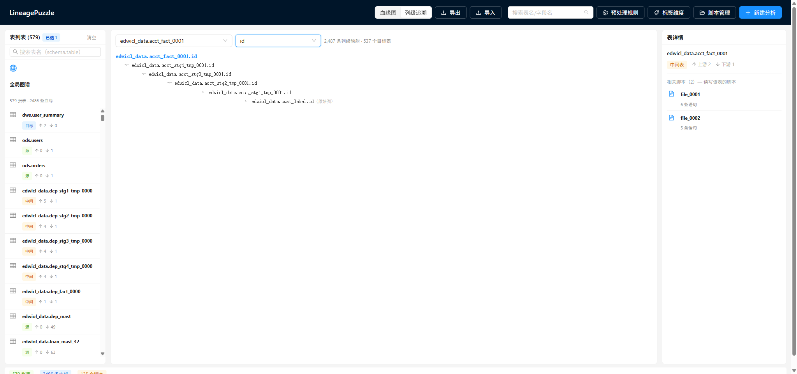
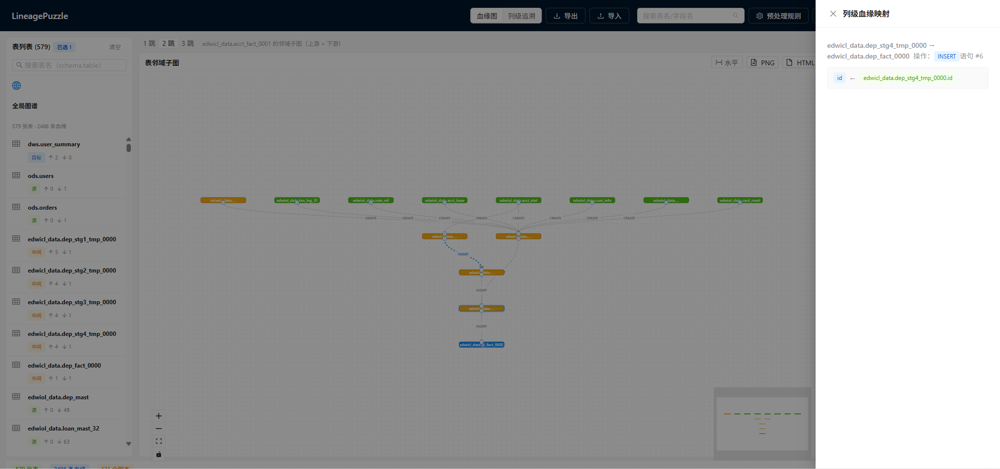
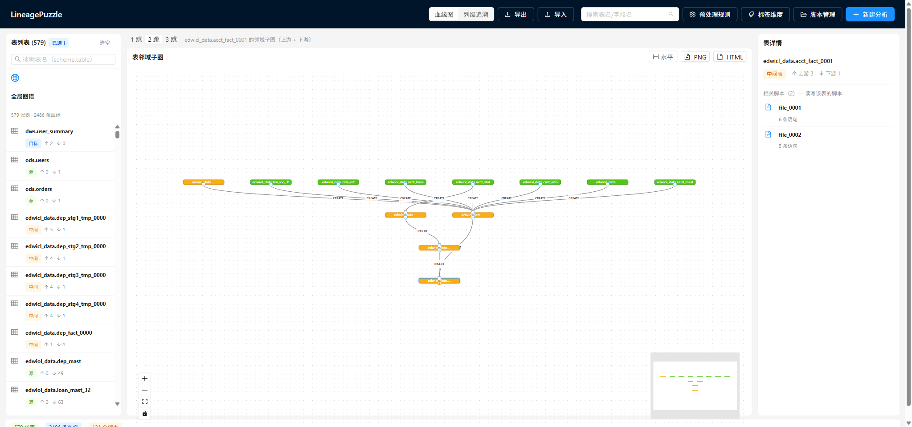
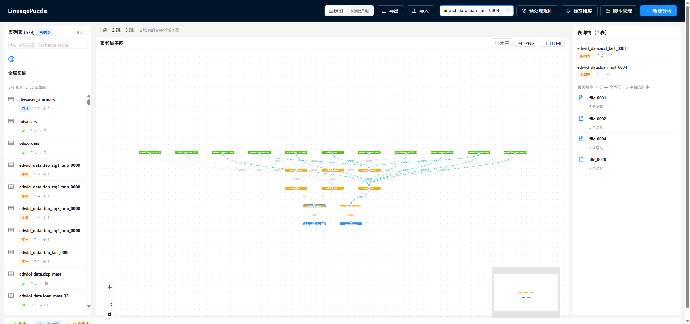
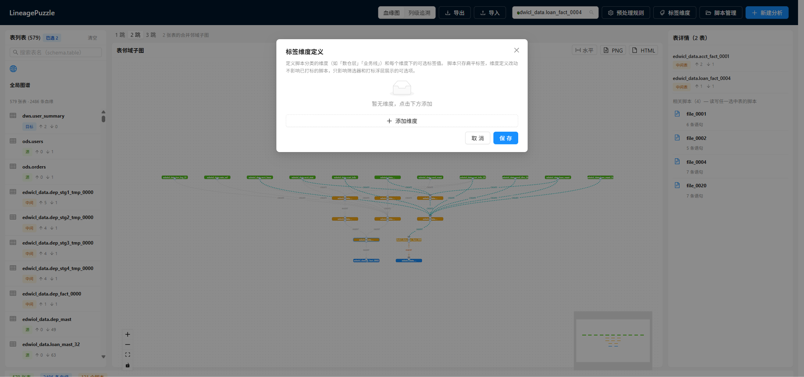
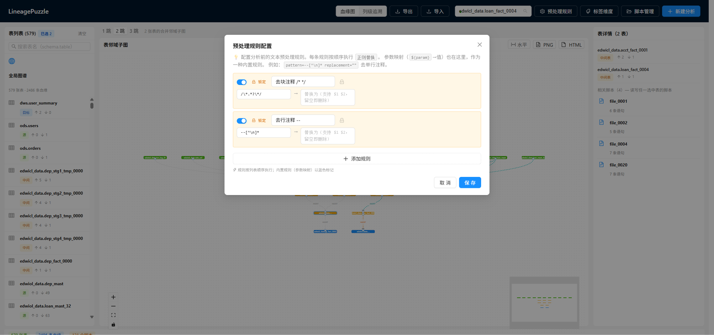

# LineagePuzzle

[![zread](https://img.shields.io/badge/Ask_Zread-_.svg?style=flat&color=00b0aa&labelColor=000000&logo=data%3Aimage%2Fsvg%2Bxml%3Bbase64%2CPHN2ZyB3aWR0aD0iMTYiIGhlaWdodD0iMTYiIHZpZXdCb3g9IjAgMCAxNiAxNiIgZmlsbD0ibm9uZSIgeG1sbnM9Imh0dHA6Ly93d3cudzMub3JnLzIwMDAvc3ZnIj4KPHBhdGggZD0iTTQuOTYxNTYgMS42MDAxSDIuMjQxNTZDMS44ODgxIDEuNjAwMSAxLjYwMTU2IDEuODg2NjQgMS42MDE1NiAyLjI0MDFWNC45NjAxQzEuNjAxNTYgNS4zMTM1NiAxLjg4ODEgNS42MDAxIDIuMjQxNTYgNS42MDAxSDQuOTYxNTZDNS4zMTUwMiA1LjYwMDEgNS42MDE1NiA1LjMxMzU2IDUuNjAxNTYgNC45NjAxVjIuMjQwMUM1LjYwMTU2IDEuODg2NjQgNS4zMTUwMiAxLjYwMDEgNC45NjE1NiAxLjYwMDFaIiBmaWxsPSIjZmZmIi8%2BCjxwYXRoIGQ9Ik00Ljk2MTU2IDEwLjM5OTlIMi4yNDE1NkMxLjg4ODEgMTAuMzk5OSAxLjYwMTU2IDEwLjY4NjQgMS42MDE1NiAxMS4wMzk5VjEzLjc1OTlDMS42MDE1NiAxNC4xMTM0IDEuODg4MSAxNC4zOTk5IDIuMjQxNTYgMTQuMzk5OUg0Ljk2MTU2QzUuMzE1MDIgMTQuMzk5OSA1LjYwMTU2IDE0LjExMzQgNS42MDE1NiAxMy43NTk5VjExLjAzOTlDNS42MDE1NiAxMC42ODY0IDUuMzE1MDIgMTAuMzk5OSA0Ljk2MTU2IDEwLjM5OTlaIiBmaWxsPSIjZmZmIi8%2BCjxwYXRoIGQ9Ik0xMy43NTg0IDEuNjAwMUgxMS4wMzg0QzEwLjY4NSAxLjYwMDEgMTAuMzk4NCAxLjg4NjY0IDEwLjM5ODQgMi4yNDAxVjQuOTYwMUMxMC4zOTg0IDUuMzEzNTYgMTAuNjg1IDUuNjAwMSAxMS4wMzg0IDUuNjAwMUgxMy43NTg0QzE0LjExMTkgNS42MDAxIDE0LjM5ODQgNS4zMTM1NiAxNC4zOTg0IDQuOTYwMVYyLjI0MDFDMTQuMzk4NCAxLjg4NjY0IDE0LjExMTkgMS42MDAxIDEzLjc1ODQgMS42MDAxWiIgZmlsbD0iI2ZmZiIvPgo8cGF0aCBkPSJNNCAxMkwxMiA0TDQgMTJaIiBmaWxsPSIjZmZmIi8%2BCjxwYXRoIGQ9Ik00IDEyTDEyIDQiIHN0cm9rZT0iI2ZmZiIgc3Ryb2tlLXdpZHRoPSIxLjUiIHN0cm9rZS1saW5lY2FwPSJyb3VuZCIvPgo8L3N2Zz4K&logoColor=ffffff)](https://zread.ai/BronyaEVE/LineagePuzzle)
[](https://z.ai)
[](./LICENSE)

> 内网环境下零依赖的 SQL 数据血缘可视化工具 —— 导入 DML 脚本，以**表为中心**导航血缘：表列表选表即看邻域子图与列级追溯，上下游双向查询，像拼图一样逐步还原整个数仓的数据流转。


---

## 🎯 为什么做这个项目

现代化的数据平台（Dataphin、WhaleOps、云厂商 DataWorks 等）和数据库本身都自带血缘分析，但它们大多假设你有一个**完整的、联网的、新建的大数据平台**。现实里很多团队的处境是：

- **调度工具老旧**：还在用 Control-M、Kettle 或自研调度，调度器只管跑脚本，从不记录"这张表的数据到底从哪来"
- **SQL 脚本堆积如山**：数仓里成百上千个 ETL 脚本，改一个表不知道会炸到哪里，接手老项目的人对着 SQL 查三天才能理清一条链路
- **数据库自带血缘不够用**：PostgreSQL 的依赖视图只到表级、不覆盖 ETL 全链路，且无法可视化
- **内网隔离，重型平台装不进来**：Airflow/DataHub/OpenLineage 这类方案要 Kafka、要 K8s、要元数据库，内网环境根本没法落地

**LineagePuzzle 就是为了这个场景而生的**：一个能装在 U 盘里、双击就跑的小工具，纯靠 SQL 语法分析提取血缘，不依赖任何大数据平台、不连数据库也能工作。把那些被先进平台"当作标配"的血缘分析能力，以最轻量的方式带到任何内网环境。

## 👥 适合谁

- **接手老项目的开发者** —— 面对一堆没文档的 ETL 脚本，想快速搞清数据从哪来、到哪去、改一张表影响谁
- **内网 / 隔离环境团队** —— 装不了重型血缘平台，需要零依赖、能离线运行的轻量方案
- **数仓开发 / 数据治理** —— 想要增量地、脚本粒度地梳理血缘，而不是一次性导入整个数据字典

---


## ✨ 核心特性

- **表为中心导航** —— 左栏是表列表（角色徽标 + 上下游计数），点击表即看它的**邻域子图**（上游+下游，1/2/3 跳可选）；**多选表**查看合并邻域，直接回答"这两张表怎么关联"
- **下游追溯与上游对称** —— 实体图内存缓存双向邻接，"这张表的数据被谁用了"和"从哪来"一样直接
- **列级追溯（文本树）** —— 选表选列，EXPLAIN 风格递归展示 `目标列 ← 源列` 及变换表达式，复杂列血缘比图更可读
- **增量构建** —— 每次导入脚本，血缘自动累积到全局图谱，无需一次性提交所有脚本
- **离线优先** —— 基于 `sqlglot` AST 静态解析，**无需数据库连接** 即可提取完整血缘
- **影响分析** —— 点击节点，高亮其全部上游链路（青色）和下游链路（橙色），菱形依赖完整覆盖
- **脚本收拢为管理单元** —— 上传/重命名/删除/打标收进「脚本管理」弹窗；从表详情下钻查看"读写该表的脚本"及其语句
- **标签筛选** —— 脚本标签投影到表，左栏按命中灰显，全局画布按标签过滤血缘切片
- **参数化 SQL** —— 支持 ETL 模板占位符 `${icl_schema}`，配合「预处理规则」替换成实际 schema
- **批量导入** —— 一次拖入多个 `.sql` 文件或 `.zip` 压缩包，每个文件成为独立脚本
- **零安装部署** —— 便携版自带 Python 运行时，目标机双击即用；LAN 共享模式支持可选 API 令牌

### 截图预览

<details>
<summary>📸 点击展开</summary>

| | |
|:---:|:---:|
| **表为中心导航（表列表 + 邻域子图 + 表详情）** | **列级追溯（文本树）** |
|  |  |
| 左栏表列表，中栏选中表的邻域子图，右栏表详情 + 相关脚本 | 选表选列，递归上游文本树（含变换表达式） |
| **列级血缘映射（点边）** | **影响分析** |
|  |  |
| 点边查看 `目标列 ← 源列` 及变换表达式 | 点节点：青色 = 上游链路，橙色 = 下游链路 |
| **节点折叠** | **搜索（表名=影响分析）** |
|  |  |
| +/- 按钮折叠/展开上下游链路 | 搜表名直接选中该表并触发双色高亮 |
| **标签维度定义** | **预处理规则** |
|  |  |
| 管理员维护维度名 + 标签值 | 正则替换规则；参数映射为内置类型 |

</details>

---

## 🚀 快速开始

提供三种形态，按你的环境选：

### 方式 A：下载桌面版（推荐，普通用户）

> 适合：想要「双击即用、关窗即退」的原生桌面体验，不想理解前后端、不想留后台进程。

1. 到 [Releases](../../releases/latest) 页面下载 `LineagePuzzle-Desktop-v2.1.0-portable.zip`（约 88MB）
2. 解压到任意目录（路径避免中文和空格）
3. 双击 `LineagePuzzle.exe` —— 弹出**原生桌面窗口**（不是浏览器），自动加载界面
4. 用完直接**关窗口**，程序彻底退出，无残留进程

**就这样。** 目标机不需要安装 Python、Node、浏览器，也不需要联网。桌面版用 PyWebView 把界面包进原生窗口（Windows 10 1803+/11 自带的 WebView2 内核），uvicorn 作为 daemon 线程跑在主进程内 —— **关窗 = 主进程退出 = 服务线程终止**，从架构上根除了「关浏览器后 uvicorn 后台残留」的痛点。

> **体积权衡：** 桌面版 ~88MB（zip）/ ~192MB（解压），比便携包大，因为打包了完整 Python 运行时 + WebView 绑定。如果在意体积或需要多人共享访问，用下面的便携包模式。

> **WebView2 依赖：** Windows 10 1803+/11 通常预装 WebView2 运行时。极少数老机器缺失时，启动会弹窗提示并给出[微软官方下载地址](https://developer.microsoft.com/microsoft-edge/webview2/)。

### 方式 B：下载便携包（内网 / 多人共享）

> 适合：内网隔离环境、想让同事通过浏览器共同访问同一实例。

1. 到 [Releases](../../releases/latest) 页面下载 `LineagePuzzle-v2.0.0-portable.zip`（约 44MB）
2. 解压到任意目录（路径避免中文和空格）
3. 双击 `run.bat` —— uvicorn **后台启动**（不保留终端窗口），浏览器自动打开 `http://localhost:8000`
4. 停止服务双击 `stop.bat`

**就这样。** 目标机不需要安装 Python、Node、Docker，也不需要联网。便携包自带 Python 3.13 运行时和全部依赖。把整个文件夹拷进 U 盘，到哪台内网机器都能跑。

> **启动/停止机制：** `run.bat` 是薄壳，通过自带的 `pythonw.exe`（无窗口版 Python）调用 `launcher.pyw`。启动器管理 uvicorn 子进程生命周期：PID 写入 `logs/lineage.pid`，uvicorn 输出重定向到 `logs/lineage.log`，启动器自身日志在 `logs/launcher.log`。服务运行中再双击 `run.bat` 只会重新打开浏览器（不会重复启动）。`stop.bat` 优先按 PID 文件停止，PID 文件失效时（比如硬关电脑后）按端口 8000 查监听进程兜底。

> 让同事访问？服务默认监听 `0.0.0.0:8000`，同事用 `http://你的IP:8000` 即可访问。拷贝 `app/data/` 给他，他启动后能看到相同的全局图谱。**安全提示**：launcher 默认启用一次性 API 令牌（浏览器自动打开带 `?token=` 的 URL），给同事的共享链接在 `logs/launcher.log` 里；隔离单机环境可用 `LINEAGE_TOKEN=off` 关闭。详见 [docs/SECURITY.md](docs/SECURITY.md)。

### 方式 C：从源码构建（开发者）

> 适合：想阅读/修改代码、贡献 PR 的开发者。需要联网环境。

```bash
git clone https://github.com/BronyaEVE/LineagePuzzle.git
cd LineagePuzzle

# 安装依赖（含从 git 拉取 lineage_puzzle 引擎包，需联网+git）
cd backend && pip install -r requirements.txt
cd ../frontend && npm install

# 启动（后端 :8000 + 前端 dev :5173）
cd .. && ./ctl.sh start
```

打开 `http://localhost:5173` ，点右上角「新建分析」，粘贴一段 SQL：

```sql
CREATE TEMP TABLE tmp_detail AS
SELECT o.id, o.amount, c.name FROM orders o JOIN customers c ON o.cid = c.id;

INSERT INTO order_report (order_id, amount, customer_name)
SELECT id, amount * 1.1, name FROM tmp_detail;
```

点「分析血缘」后，左栏表列表会出现 `orders`、`customers`（绿）→ `tmp_detail`（黄）→ `order_report`（蓝）。**点击 `order_report`** —— 中栏显示它的邻域子图（可切 1/2/3 跳，可多选表合并查看），右栏显示角色/上下游计数和"读写该表的脚本"（点击下钻语句）。切到「列级追溯」标签选列，可看递归上游文本树。全局图谱仍是置顶入口，但大图下不再是默认视图（发面饼不可读，子图才是答案）。

**一体化部署**（生产，单端口）：

```bash
cd frontend && npm run build        # 构建前端到 dist/
cd ../backend && uvicorn app.main:app --host 0.0.0.0 --port 8000
```

打开 `http://localhost:8000`（单进程同时服务页面 + API）。

> **不需要数据库**。血缘提取纯靠 SQL 语法解析，数据库仅用于可选的表存在性校验。

**桌面版打包**（开发者本地构建最新版）：

```bash
pack_desktop.bat    # 产出 dist/LineagePuzzle/（约 200MB，PyInstaller onedir）
```

---

## 🧩 两种分析模式

| 模式 | 适用 | 说明 |
|------|------|------|
| **离线模式**（默认） | 无数据库环境 | 纯 AST 解析，粘贴 SQL 即可，提示「分析完成（离线模式）」 |
| **在线模式** | 有 PostgreSQL | 展开「高级选项」填连接信息，额外校验表是否存在、补充列信息 |

---

## 📖 功能一览

### 表为中心导航（默认工作流）

- **左栏表列表**：搜索 + 角色徽标（源/中间/目标）+ 直接上下游计数；标签筛选按"命中脚本读写的表"灰显
- **中栏邻域子图**：单表 = 上游+下游 N 跳子图；**多选 = 合并邻域**（表间关联直接可见，选中表蓝框强调）；全局图谱为置顶的非默认入口（小图默认全局，大图默认空态）
- **右栏表详情**：角色、上下游计数、**相关脚本**（由边的 script 溯源汇总，点击 Drawer 查看语句分段）

### 列级追溯（文本树）

切到「列级追溯」标签，选表选列，递归展开上游列（含环检测）：

```
edwicl_data.acct_fact_0001.id
  ← edwicl_data.acct_stg4_tmp_0001.id
    ← edwicl_data.acct_stg3_tmp_0001.id
      ← ... ← edwiol_data.cust_label.id（原始列）
```

复杂列血缘下文本树比图可读得多；与"点边看映射"互补（后者看单条边，前者看整条链）。

### 列级血缘（点边查看）

点击图中任意一条边，右侧 Drawer 展示该边的列级映射：

```
public.orders → public.order_report   操作：INSERT   语句 #1

[order_id]      ← [public.orders.id]
[amount]        ← [public.orders.amount]      变换：amount * 1.1
[customer_name] ← [public.customers.name]
```

支持：显式列映射、JOIN+别名、聚合（`SUM`/`COUNT`）、表达式（`price*qty`）、CTAS、UPDATE SET、**派生表穿透**（子查询列追溯到物理表）。`SELECT *` 因无表结构降级为表级（边仍正常生成）。

### 影响分析（点节点高亮链路）

点击节点，高亮其**全部**上下游链路（基于内存图缓存的 `all_simple_paths`，菱形依赖完整覆盖）：

- 🔽 下游（改这张表会影响谁）—— 橙色高亮
- 🔼 上游（这张表的数据来自谁）—— 青色高亮

### 脚本管理（弹窗）

脚本不再是导航单元：上传、重命名、删除、单条/批量打标收进顶栏「脚本管理」弹窗；日常查血缘从表出发，脚本作为边的溯源信息从表详情下钻。

### 批量导入

「新建分析」弹窗切换到「批量导入文件」标签，拖入多个 `.sql` 或一个 `.zip`（含多个 `.sql`），每个文件成为独立脚本。

### 其他

- **搜索框**：模糊匹配表名/字段名。搜表名直接选中该表（进入邻域子图）；搜字段高亮该字段流转经过的所有边
- **预处理规则**：配置正则替换规则（name/pattern/replacement/enabled），应对各种奇怪 SQL 格式；参数映射为内置规则特例（id 以 `param-` 前缀），分析时自动应用
- **导入/导出**：一键备份/迁移全部血缘数据（JSON）
- **图导出**：导出当前图谱为 PNG / 独立 HTML

> 完整功能说明、架构设计、API 文档见 **[docs/PROJECT.md](docs/PROJECT.md)**。

---

## 🏗️ 技术栈

| 层 | 技术 |
|----|------|
| 前端 | React 19 + TypeScript + antd v6 + React Flow (@xyflow/react v12) |
| 后端 | Python FastAPI + Pydantic |
| SQL 解析 | [lineage_puzzle](https://github.com/BronyaEVE/lineage_puzzle) 引擎包（sqlglot AST 静态解析，唯一血缘来源；本仓不内嵌引擎副本） |
| 图算法 | networkx（影响分析的最短/全路径、环检测） |
| 存储 | JSON / JSONL + filelock（无数据库依赖）；实体图内存缓存（双向邻接） |
| 部署 | Python embeddable（便携版零安装）；LAN 模式可选 API 令牌 |

---

## 📂 项目结构

```
datalineage_visualizer/
├── backend/
│   ├── app/
│   │   ├── api/           # FastAPI 路由（16 个 REST 端点）
│   │   ├── services/      # 分析编排、实体图存储（缓存）、DB 校验、预处理规则
│   │   │                   # （引擎管线来自 lineage_puzzle 包依赖，见 requirements.txt）
│   │   ├── models/        # Pydantic 数据模型
│   │   └── main.py        # FastAPI 应用 + 令牌鉴权 + GZip + 静态托管
│   ├── tests/             # 156 个测试（引擎的 127 个测试已随包迁至 lineage_puzzle 仓）
│   └── requirements.txt   # 9 个核心依赖
├── frontend/
│   └── src/
│       ├── components/    # 血缘图、搜索框、批量导入等组件
│       ├── api/           # REST 客户端
│       └── types/         # TypeScript 类型定义
├── docs/
│   ├── PROJECT.md         # 详细项目文档（架构/API/深度用法）
│   └── images/            # 截图
├── ctl.sh                 # 一键启停脚本
├── desktop.py             # 桌面版入口（PyWebView 窗口模式）
├── LineagePuzzle.spec     # 桌面版 PyInstaller 打包配置
├── pack_desktop.bat       # 桌面版打包脚本
└── pack_portable.bat      # 便携版打包脚本
```

---

## 📊 测试

```bash
cd backend && python -m pytest    # 156 passed（引擎测试在 lineage_puzzle 仓，另 142 个）
```

Web 侧测试（6 个文件；引擎测试已迁至 [lineage_puzzle](https://github.com/BronyaEVE/lineage_puzzle) 仓）：

| 文件 | 覆盖范围 |
|------|---------|
| `test_api` | 全部 REST 端点（TestClient 端到端）、导入路径穿越防护、标签端点 |
| `test_store` | 持久化、影响分析、导入导出、路径遍历防护、标签维度+打标、缓存一致性 |
| `test_impact_analysis` | all_simple_paths、菱形依赖、路径爆炸防护 |
| `test_analyzer` | 分析编排、DB 降级 |
| `test_param_mapping` | 参数替换、预处理规则 CRUD、自动迁移 |
| `conftest` | 共享数据目录隔离（redirect_store，防测试写进真实 data/） |

---

## 📄 License

[MIT](./LICENSE)
